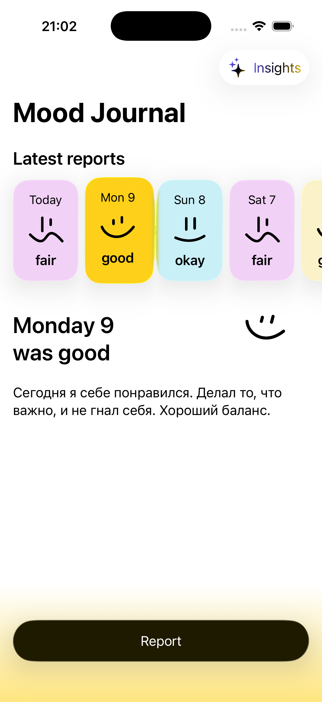
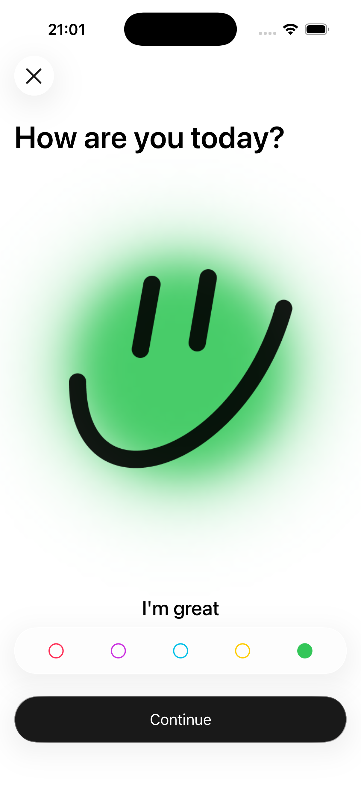
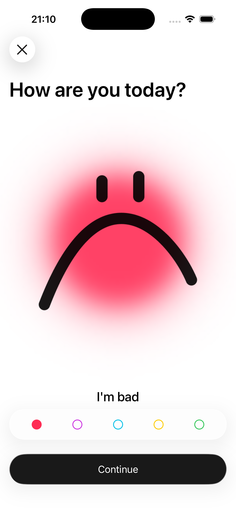
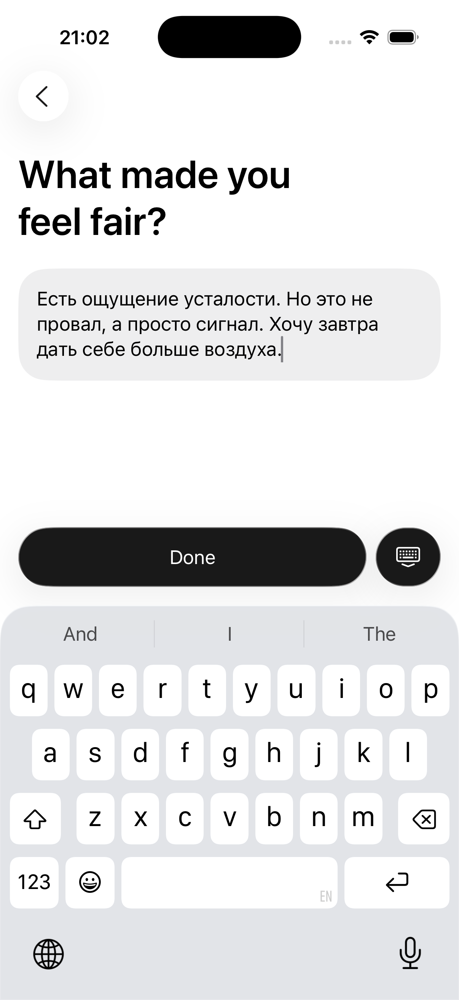
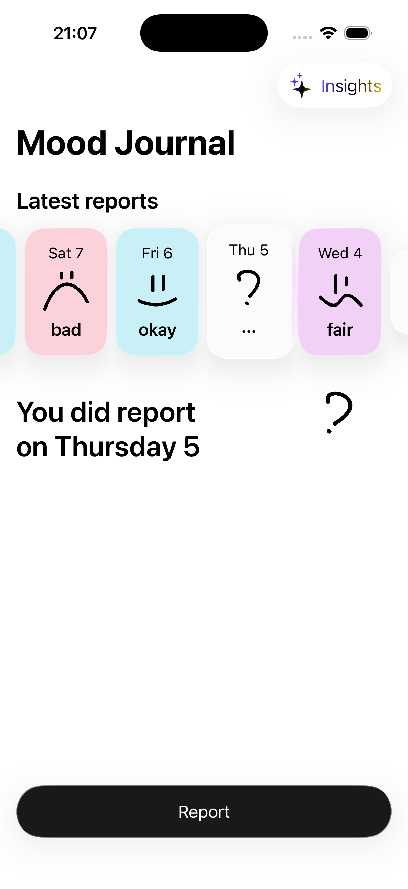
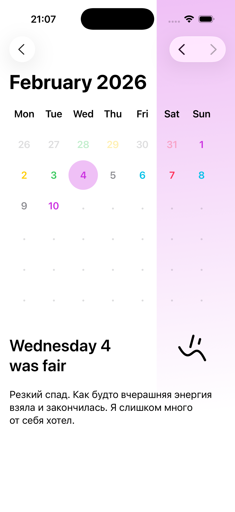
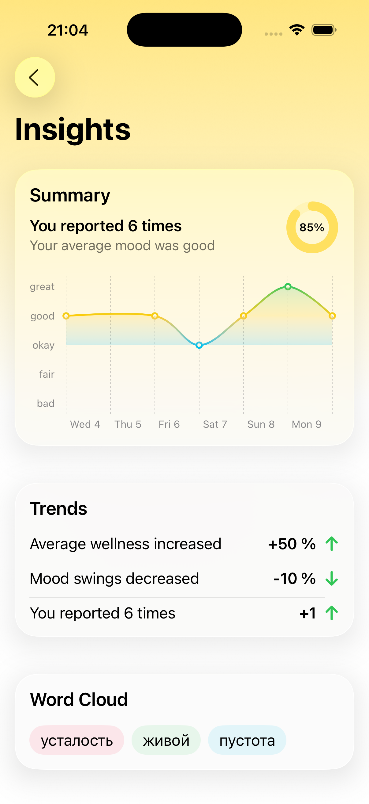
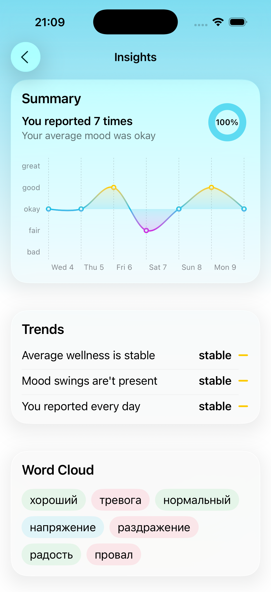

## MoodTracker – трекер настроения с анализом текста

Учебный iOS‑проект, который помогает отслеживать настроение и получать **инсайты на основе естественного языка**: пользователь описывает свой день словами, а приложение разбирает текст и строит визуальные отчёты.

## Цель проекта

- **Закрепить работу с современным стеком iOS**: Swift, SwiftUI, SwiftData, модульная архитектура, Coordinator‑паттерн.
- **Потренироваться в обработке natural language** на русском языке: определение языка, лемматизация, разбор частей речи, работа с пользовательским словарём тональностей.
- **Спроектировать кастомный UI**: от экранов ввода отчёта до дашборда с инсайтами (summary, тренды, облако слов).

## Задача, которую решает приложение

- **Сбор данных о настроении**: пользователь отмечает уровень настроения и пишет короткое текстовое описание дня.
- **Анализ текста**:
  - определение доминирующего языка с помощью `NLLanguageRecognizer`;
  - разбор текста по частям речи через `NLTagger` (существительные, глаголы, прилагательные);
  - извлечение токенов и сопоставление их с кастомным словарём `Rusentilex` (JSON со словами и их тональностью).
- **Построение инсайтов**:
  - суммарные показатели и динамика настроения;
  - тренды по периодам;
  - облако наиболее частых слов/лейтмотивов из пользовательских описаний.

## Реализация и архитектура

- **Архитектура**
  - Точка входа: `MoodTrackerApp` на SwiftUI.
  - Навигация через `Coordinator` и `NavigationRootView`.
  - Разделение на слои: `Data` (модели, репозитории), `Helpers` (AI/NL, сервисы), `UI` (экраны и компоненты), `Resources` (ассеты и словари).
- **Работа с natural language**
  - `NaturalLanguageService` использует `NaturalLanguage`‑фреймворк для:
    - определения языка текста;
    - лемматизации (`.lemma`) и получения нормальных форм слов;
    - фильтрации по лексическим классам (существительные, глаголы, прилагательные);
    - построения набора `SentimentToken` на основе словаря `Rusentilex`.
  - `Rusentilex` подгружается из `Rusentilex.json` в бандле и декодируется в словарь `[String: SentimentToken]`.
- **Хранение данных**
  - Репозитории (`SwiftDataRepository`, `MockRepository`) инкапсулируют доступ к данным.
  - Основные модели: `Report`, `Score` + расширения для вычисляемых свойств и представления в UI.
- **Кастомный UI**
  - Экран `Home` с последними отчётами, градиентным фоном и быстрым переходом к инсайтам.
  - Экран `EditReport` как многошаговый сценарий: выбор эмоции, ввод текстового описания, подтверждение.
  - Экран `Insights` с карточками:
    - **Summary** (прогресс‑круг, сводный чарт);
    - **Trends** (тренды настроения);
    - **Word Cloud** (облако слов на основе токенов из текста).
  - Собственные компоненты (`NavigationButton`, `GradientBackgroundView`, элементы календаря и отчётов) в едином визуальном стиле.

## Технический стек

- **Язык**: Swift
- **UI**: SwiftUI (кастомный дизайн, адаптивные layout‑ы, градиенты, анимации)
- **Данные**: SwiftData + репозиторный слой (`SwiftDataRepository`, `MockRepository`)
- **Natural Language Processing**:
  - Apple `NaturalLanguage` (`NLLanguageRecognizer`, `NLTagger`, схемы `.lexicalClass`, `.lemma`);
  - собственный словарь тональностей `Rusentilex` (JSON + `Codable`‑обёртка);
  - модель `SentimentToken` для представления слов и их «веса».
- **Архитектурные подходы**: MVVM (ViewModel‑ы для экранов), Coordinator‑паттерн для навигации, отдельные сервисы для AI/NL и отчётов.

## Скриншоты

<table>
  <tr>
    <td style="border: none;"></td>
    <td style="border: none;"></td>
    <td style="border: none;"></td>
    <td style="border: none;"></td>
  </tr>
  <tr>
    <td style="border: none;"></td>
    <td style="border: none;"></td>
    <td style="border: none;"></td>
    <td style="border: none;"></td>
  </tr>
</table>

